# Portfolio - Moammar Iqbal

## Tentang Saya

Saya adalah Fullstack Web Developer yang berfokus pada pengembangan aplikasi web berbasis Laravel dan React. Berdasarkan pengalaman yang tercantum di CV, saya terbiasa membangun sistem terintegrasi, melakukan validasi data, mengembangkan fitur backend, serta menghubungkan sistem melalui API untuk kebutuhan operasional yang membutuhkan data konsisten dan real-time.

Pengalaman saya mencakup pengembangan sistem internal, dashboard, monitoring transaksi, dokumentasi API, serta pengelolaan dan visualisasi data. Saya pernah berkontribusi di Diskominfo Kabupaten Cirebon sebagai Fullstack Web Developer & Data Intern, kemudian melanjutkan pengalaman di Transferku sebagai Software Engineer Intern dan Staff mulai 1 Mei 2026.

Latar belakang Komputerisasi Akuntansi membantu saya memahami kebutuhan bisnis, pencatatan transaksi, laporan, dan pengolahan data. Kombinasi web development, API integration, data analytics, dan pemahaman proses bisnis menjadi nilai utama yang saya bawa dalam membangun solusi digital yang efisien, rapi, dan mudah digunakan.

---

## Ringkasan Keahlian

### Programming & Framework

| Area | Keahlian |
|---|---|
| Backend | Laravel, API Development, Blade |
| Frontend | React, HTML, CSS, JavaScript, Tailwind CSS, jQuery |
| Programming | Python, JavaScript |
| Web Development | Fullstack Web Development, CRUD, dashboard, integrasi frontend-backend |

### Database

| Area | Keahlian |
|---|---|
| Relational Database | MySQL |
| Data Handling | Validasi data, monitoring data, data cleaning, pengelolaan data terstruktur |

### Tools

| Area | Tools |
|---|---|
| Development | GitHub, API, Laravel ecosystem |
| Productivity | Microsoft Excel, Microsoft Word, Microsoft PowerPoint |
| Documentation | Dokumentasi sistem, dokumentasi penggunaan, dokumentasi API |

### Data / AI / Analytics

- Data Mining
- Machine Learning
- Deep Learning
- Data Visualization
- Data Analyst
- Data Science
- Integrasi model AI untuk pemrosesan transaksi berbasis bahasa natural

---

## Pengalaman

### Software Engineer Intern, Staff - Transferku

**Periode:** November 2025 - Sekarang  
**Tipe:** Internship, kemudian Staff mulai 1 Mei 2026

Berperan dalam pengembangan sistem internal berbasis web dan mendukung kebutuhan integrasi sistem di lingkungan fintech/remitansi.

**Tanggung Jawab / Kontribusi:**

- Mengembangkan sistem internal berbasis web.
- Membangun dan mengintegrasikan API untuk sinkronisasi data real-time.
- Melakukan validasi dan monitoring transaksi untuk menjaga konsistensi sistem.
- Mengembangkan fitur backend menggunakan Laravel dan melakukan integrasi dengan frontend.

**Teknologi / Tools:**

- Laravel
- React
- MySQL
- API
- Blade
- Tailwind CSS
- JavaScript

### Fullstack Web Developer & Data Intern - Diskominfo Kabupaten Cirebon

**Periode:** Maret 2025 - Juni 2025  
**Tipe:** Magang / Internship

Berkontribusi dalam pengembangan sistem pencatatan dan pengelolaan data desa berbasis web, termasuk pengolahan data menjadi laporan dan visualisasi untuk mendukung monitoring.

**Tanggung Jawab / Kontribusi:**

- Mengembangkan sistem pencatatan dan pengelolaan data desa berbasis web.
- Melakukan input, verifikasi, dan pembaruan data agar informasi tetap akurat dan konsisten.
- Mengolah data menjadi laporan serta visualisasi dalam bentuk grafik/dashboard.
- Berkoordinasi dengan tim dan pengguna untuk memastikan sistem sesuai kebutuhan operasional.
- Melakukan pengecekan dan pembersihan data untuk meminimalkan kesalahan pencatatan.
- Mendokumentasikan alur kerja dan penggunaan sistem sebagai panduan operasional.

**Teknologi / Tools:**

- Web Development
- Data Cleaning
- Data Visualization
- Dashboard
- Microsoft Excel
- Dokumentasi sistem

---

## Project Portfolio

### 1. AI-Powered Accounting Journal

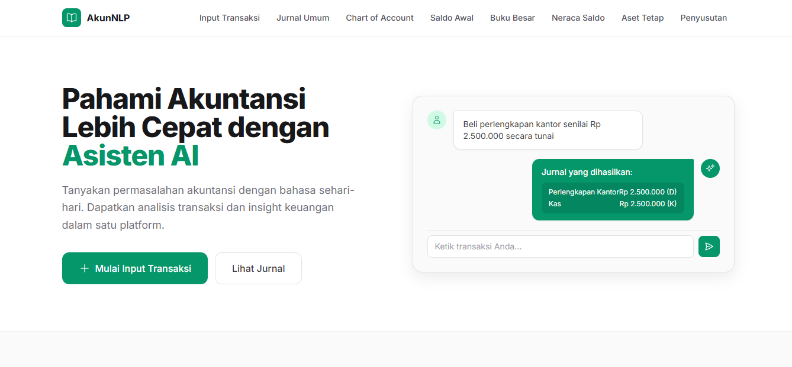

**Deskripsi:**  
AI-Powered Accounting Journal adalah sistem penjurnalan akuntansi yang terintegrasi dengan model AI. Sistem ini membantu pengguna non-akuntan mencatat transaksi menggunakan bahasa natural, kemudian mengolahnya menjadi jurnal hingga laporan seperti neraca saldo.

**Tujuan Project:**  
Mempermudah pencatatan akuntansi bagi pengguna yang tidak memiliki latar belakang akuntansi, sehingga proses input transaksi dapat dilakukan dengan kalimat sederhana dan lebih mudah dipahami.

**Role Saya:**  
Fullstack Developer

**Fitur Utama:**

- Input transaksi menggunakan bahasa natural.
- Bantuan AI untuk memahami transaksi dan menyusun jurnal.
- Jurnal umum.
- Chart of Account.
- Saldo awal.
- Buku besar.
- Neraca saldo.
- Aset tetap.
- Penyusutan.

**Teknologi yang Digunakan:**

- Laravel
- Blade
- Tailwind CSS
- MySQL
- Model AI / LLaMA 4

**Highlight Teknis:**

- Integrasi AI untuk menerjemahkan deskripsi transaksi menjadi pencatatan akuntansi.
- Alur akuntansi dari input transaksi sampai laporan dasar.
- Antarmuka yang disusun agar pengguna non-akuntan dapat memahami proses pencatatan.

**Hasil / Dampak:**

- Membantu menyederhanakan proses penjurnalan akuntansi.
- Mengurangi hambatan pengguna non-akuntan dalam memahami pencatatan debit dan kredit.
- Menjadi contoh penerapan AI pada domain akuntansi praktis.

**Link Demo / Repository:**  
Repository: `MoammarIqbal/AI-Powered-Accounting-Journal`  
Demo: [https://ai-powered-accounting-journal.freedev.app/](https://ai-powered-accounting-journal.freedev.app/)

**Screenshot Pendukung:**

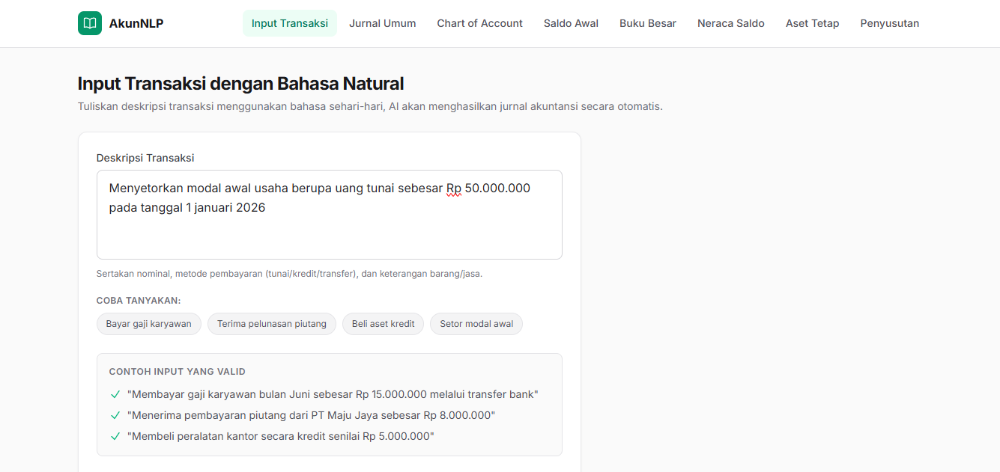

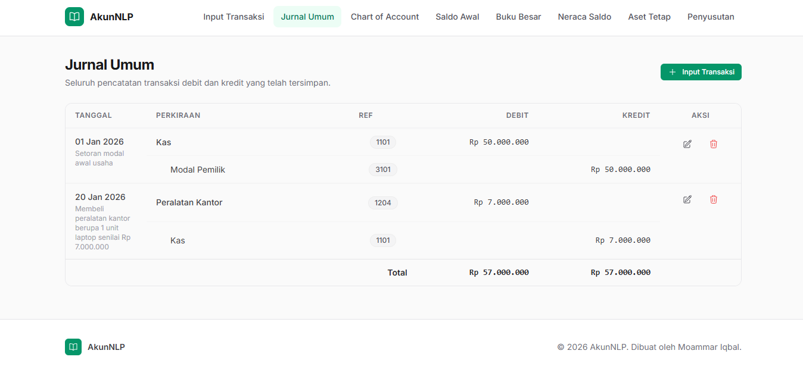

---

### 2. Sistem Arsip Surat

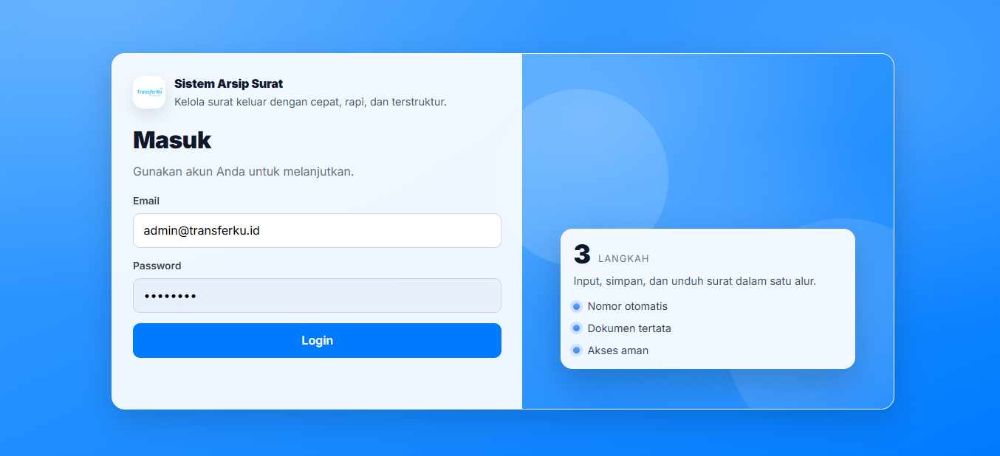

**Deskripsi:**  
Sistem Arsip Surat adalah aplikasi web yang dikembangkan secara mandiri untuk kebutuhan penyimpanan dan pengelolaan surat di PT. Graha Remitansi Indonesia (TransferKu). Sistem ini membantu proses administrasi surat menjadi lebih rapi, terstruktur, dan mudah dicari.

**Tujuan Project:**  
Menyediakan sistem arsip internal untuk mengelola data surat, user, divisi, dan kode klasifikasi surat, sekaligus mempercepat pembuatan nomor surat dengan format otomatis.

**Role Saya:**  
Fullstack Developer

**Fitur Utama:**

- Dashboard arsip surat.
- Manajemen surat.
- Manajemen user.
- Manajemen divisi.
- Manajemen kode klasifikasi.
- Generate nomor surat otomatis berdasarkan tahun, bulan, dan kode klasifikasi.

**Teknologi yang Digunakan:**

- Laravel
- MySQL
- Tailwind CSS
- Blade

**Highlight Teknis:**

- Implementasi generate nomor surat otomatis.
- Pengelolaan data referensi seperti divisi dan kode klasifikasi.
- CRUD surat dan pengaturan administrasi internal.
- Antarmuka berbasis web untuk memudahkan akses operasional.

**Hasil / Dampak:**

- Membantu penyimpanan surat perusahaan menjadi lebih terdokumentasi.
- Mengurangi proses manual dalam pembuatan nomor surat.
- Memudahkan pencarian dan pengelolaan arsip internal.

**Link Demo / Repository:**  
Repository: Private  
Demo: [https://transferku.id/tools/sistem-arsip-surat/public/](https://transferku.id/tools/sistem-arsip-surat/public/)

**Screenshot Pendukung:**

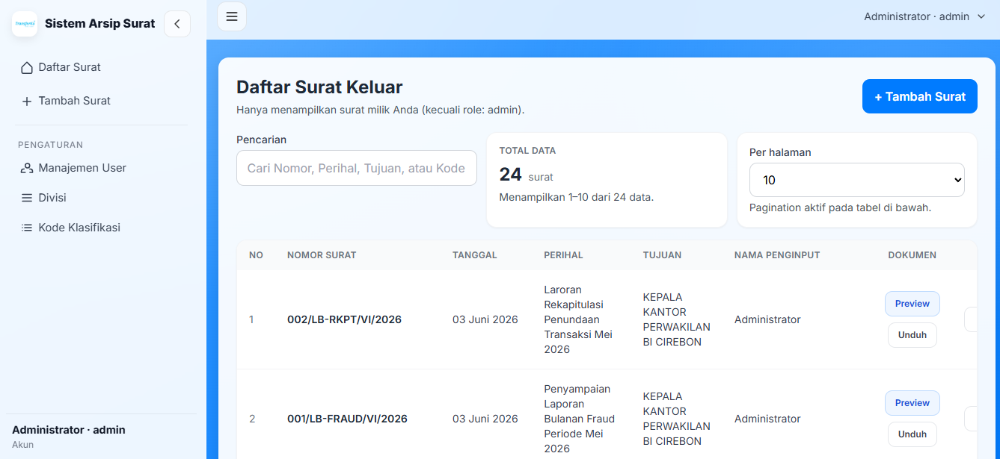

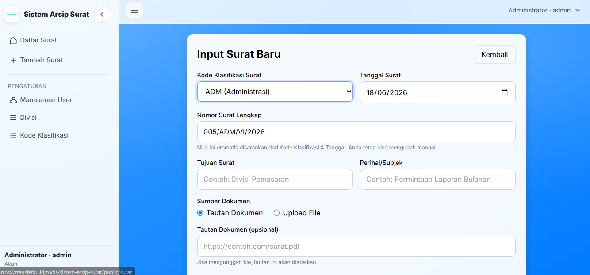

---

### 3. AML Monitoring System

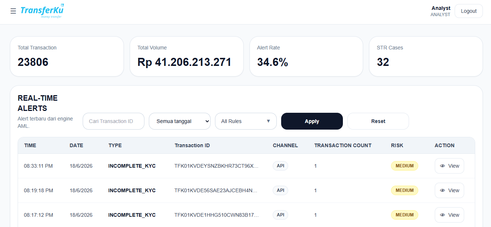

**Deskripsi:**  
AML Monitoring System adalah sistem monitoring transaksi yang dikembangkan secara fullstack untuk PT. Graha Remitansi Indonesia (TransferKu). Sistem ini mendukung pemantauan transaksi untuk kebutuhan Anti-Money Laundering, fraud prevention, pencegahan pendanaan terorisme, dan risiko terkait senjata pemusnah massal.

**Tujuan Project:**  
Membantu perusahaan memonitor transaksi, melakukan screening sender dan beneficiary, mengklasifikasikan transaksi mencurigakan, serta menyediakan workflow review dan export laporan.

**Role Saya:**  
Fullstack Developer

**Fitur Utama:**

- Dashboard monitoring transaksi.
- Screening sender dan beneficiary menggunakan international sanction list.
- AML Engine untuk klasifikasi transaksi mencurigakan.
- Alert detail dan review kasus.
- Export laporan.
- Integrasi dengan payment gateway TransferKu.

**Teknologi yang Digunakan:**

- Laravel
- React
- Tailwind CSS
- MySQL
- API
- JavaScript

**Highlight Teknis:**

- Integrasi API untuk menerima dan memproses transaksi.
- Screening transaksi terhadap sanction list internasional.
- Dashboard real-time alerts untuk membantu proses monitoring.
- Workflow review dan export laporan untuk kebutuhan operasional compliance.
- Pemisahan frontend React dan backend Laravel untuk mendukung skalabilitas aplikasi.

**Hasil / Dampak:**

- Mendukung proses monitoring transaksi yang lebih terstruktur.
- Membantu identifikasi transaksi yang perlu ditinjau lebih lanjut.
- Menyediakan tampilan dashboard dan detail alert untuk mempercepat proses analisis.

**Link Demo / Repository:**  
Repository: Private  
Demo: [https://aml-dash.transferku.id/](https://aml-dash.transferku.id/)

**Screenshot Pendukung:**

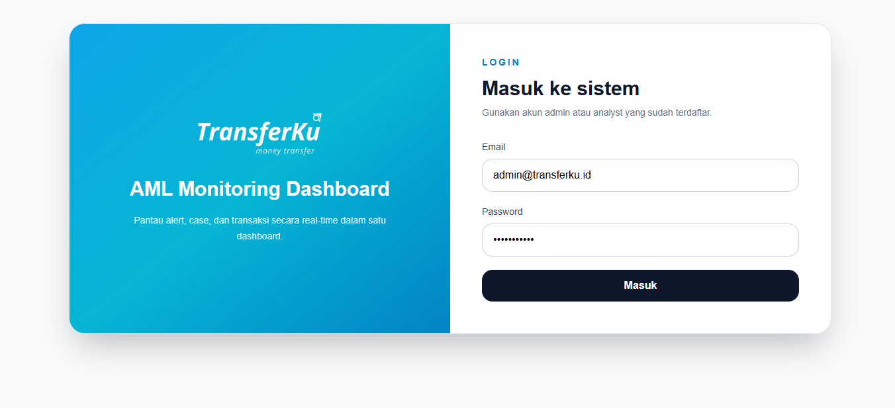

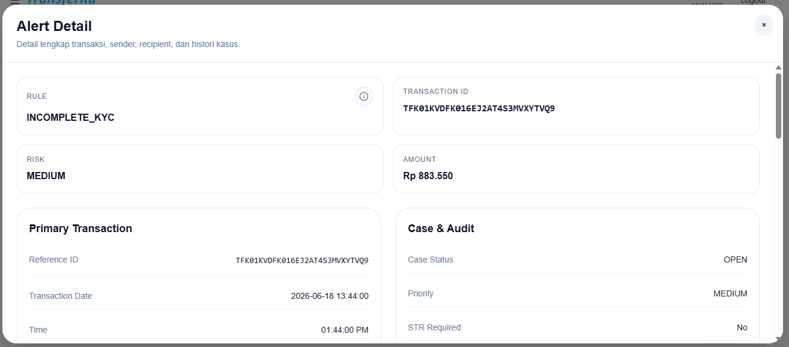

---

### 4. Transferku

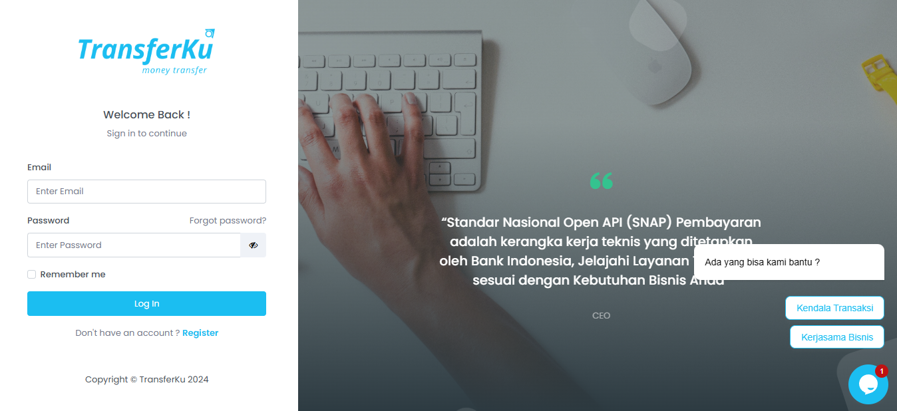

**Deskripsi:**  
Transferku adalah sistem remitansi digital untuk transfer internasional dan domestik. Saya membantu mengembangkan sistem ini, termasuk dukungan transaksi B2B, B2C, C2B, dan C2C.

**Tujuan Project:**  
Mendukung proses transaksi remitansi digital agar dapat berjalan melalui sistem dashboard dan integrasi API sesuai kebutuhan bisnis.

**Role Saya:**  
Software Engineer / Web Developer

**Fitur Utama:**

- Dashboard transaksi.
- Dukungan transaksi internasional dan domestik.
- Dukungan model transaksi B2B, B2C, C2B, dan C2C.
- Integrasi API.
- Pengelolaan data transaksi.

**Teknologi yang Digunakan:**

- Laravel
- MySQL
- Blade
- Tailwind CSS
- jQuery
- API

**Highlight Teknis:**

- Pengembangan fitur backend dan dashboard.
- Integrasi API untuk kebutuhan transaksi.
- Validasi dan monitoring data transaksi.
- Dukungan workflow bisnis remitansi digital.

**Hasil / Dampak:**

- Mendukung operasional sistem remitansi digital.
- Membantu pengembangan fitur untuk pengelolaan transaksi dan integrasi sistem.

**Link Demo / Repository:**  
Repository: Private  
Web: [https://dashboard.transferku.id/](https://dashboard.transferku.id/)

**Screenshot Pendukung:**

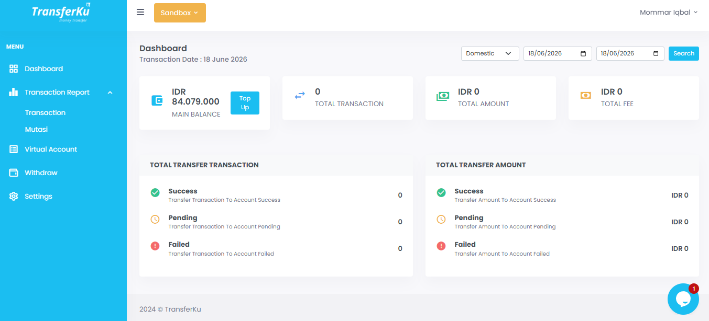

---

### 5. Dokumentasi Transferku

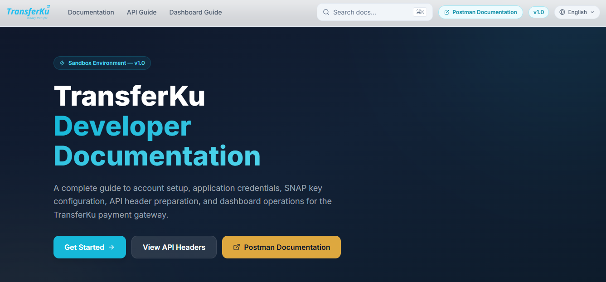

**Deskripsi:**  
Dokumentasi Transferku adalah web dokumentasi yang dikembangkan untuk membantu partner memahami proses integrasi API Transferku ke sistem mereka.

**Tujuan Project:**  
Menyediakan dokumentasi teknis yang rapi dan mudah diakses agar proses onboarding dan integrasi partner dapat berjalan lebih jelas.

**Role Saya:**  
Frontend Developer / Documentation Developer

**Fitur Utama:**

- Halaman dokumentasi developer.
- Panduan integrasi API.
- Panduan dashboard.
- Struktur dokumentasi untuk registration steps dan kebutuhan integrasi partner.

**Teknologi yang Digunakan:**

- React
- Tailwind CSS

**Highlight Teknis:**

- Pengembangan web dokumentasi berbasis React.
- Penyusunan struktur dokumentasi untuk kebutuhan partner.
- Tampilan dokumentasi yang mendukung navigasi teknis dan pencarian informasi.

**Hasil / Dampak:**

- Membantu partner memahami alur integrasi API Transferku.
- Menyediakan referensi teknis yang lebih terstruktur dan mudah dibagikan.

**Link Demo / Repository:**  
Repository: Private  
Web: [https://docs.transferku.id/](https://docs.transferku.id/)

**Screenshot Pendukung:**

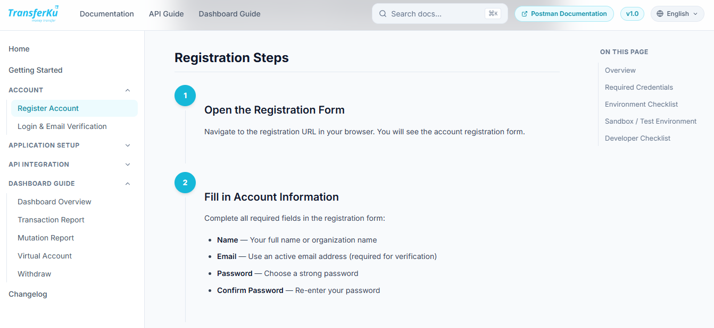

---

## Sertifikasi

### Zahir User Certified
**Penerbit:** Zahir  
**Bidang:** Accounting Software / Zahir Accounting  
**File:** [Lihat Sertifikat](assets/certificates/accounting-zahir-1.pdf)

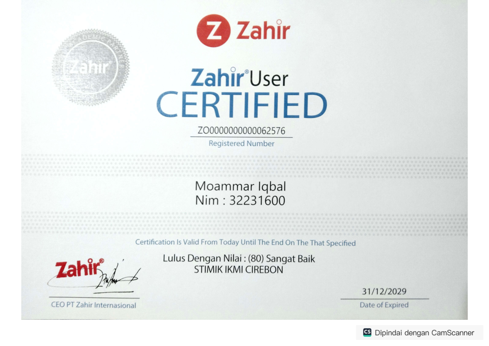

> Catatan: Detail diambil dari visual sertifikat karena teks PDF tidak terbaca penuh.
### Sertifikat Zahir Accounting 6
**Penerbit:** Zahir  
**Bidang:** Accounting Software / Zahir Accounting  
**File:** [Lihat Sertifikat](assets/certificates/accounting-zahir-2.pdf)

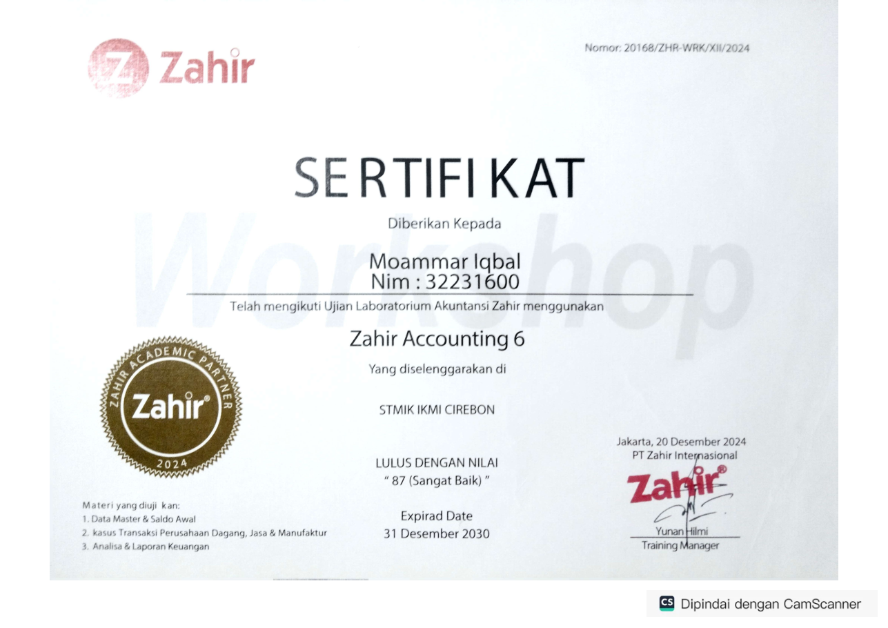

> Catatan: Detail diambil dari visual sertifikat karena teks PDF tidak terbaca penuh.
### Juara Harapan 3 - Kompetisi Nasional APTIKOM Pesta Data Nasional
**Penerbit:** APTIKOM / Pesta Data Nasional  
**Bidang:** Data Competition / Data Analytics  
**File:** [Lihat Sertifikat](assets/certificates/data-driven-skills-moammar-iqbal-juara-harapan-3-pesta-data.pdf)

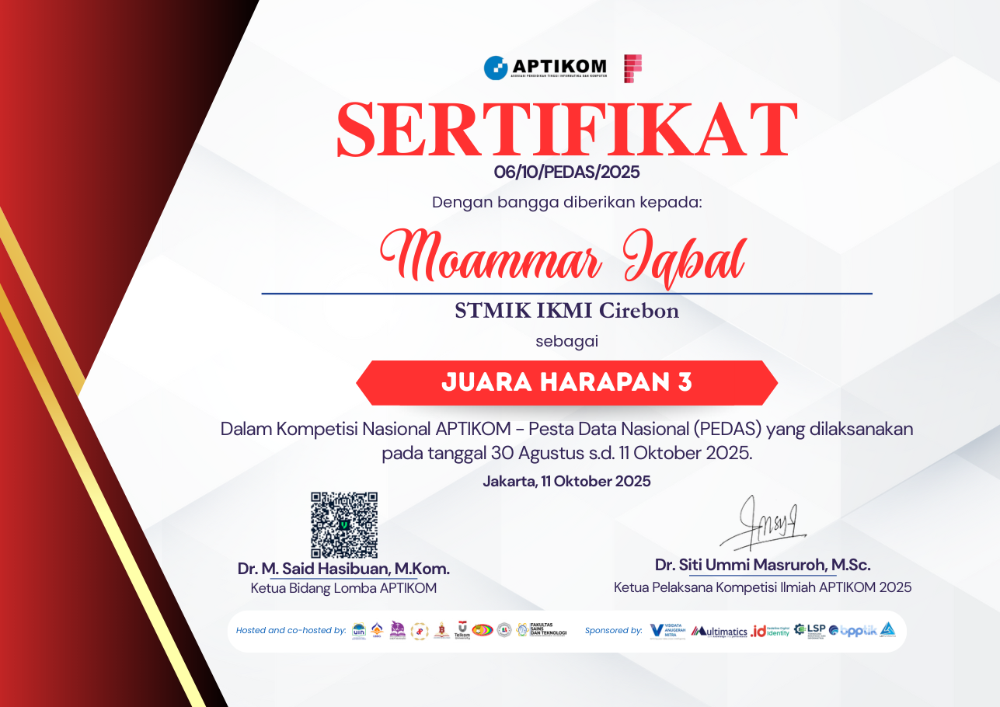
### Silver Award - Babak Penyisihan Pesta Data Nasional
**Penerbit:** APTIKOM / Pesta Data Nasional  
**Bidang:** Data Competition / Data Analytics  
**File:** [Lihat Sertifikat](assets/certificates/data-driven-skills-moammar-iqbal-babak-penysihan-pesta-data.pdf)

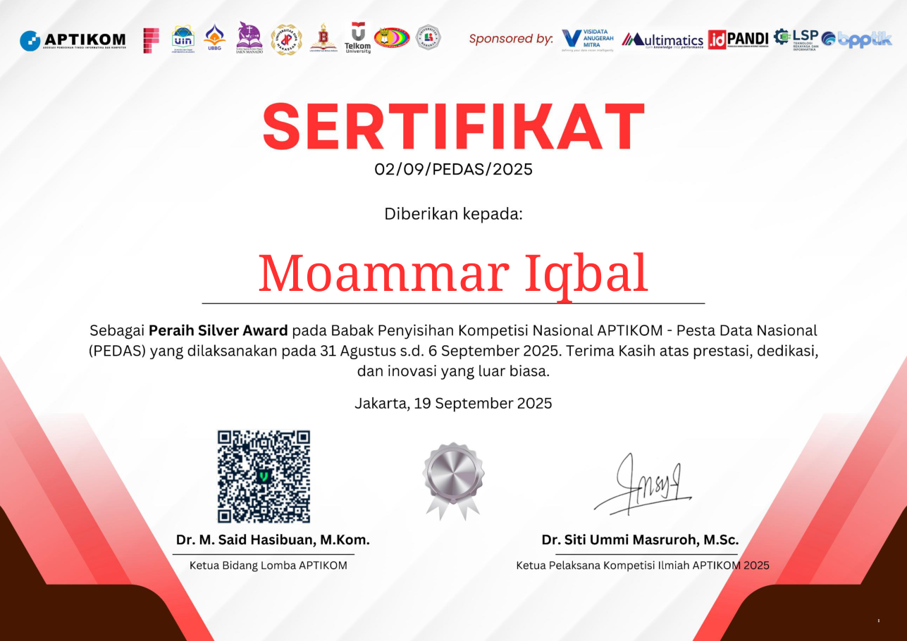
### Peserta Lomba Machine Learning - Sriwijaya Informatics Exhibition 2025
**Penerbit:** HMIF Universitas Sriwijaya / SRIFOTON 2025  
**Bidang:** Machine Learning  
**File:** [Lihat Sertifikat](assets/certificates/data-driven-skills-sertifikat-peserta-moammar-iqbal-ml.pdf)

### Sertifikat Magang / Kerja Praktik
**Penerbit:** Diskominfo Kabupaten Cirebon  
**Bidang:** Internship / Web Development & Data  
**File:** [Lihat Sertifikat](assets/certificates/magang-sertifikat-magang-moammar-iqbal.pdf)

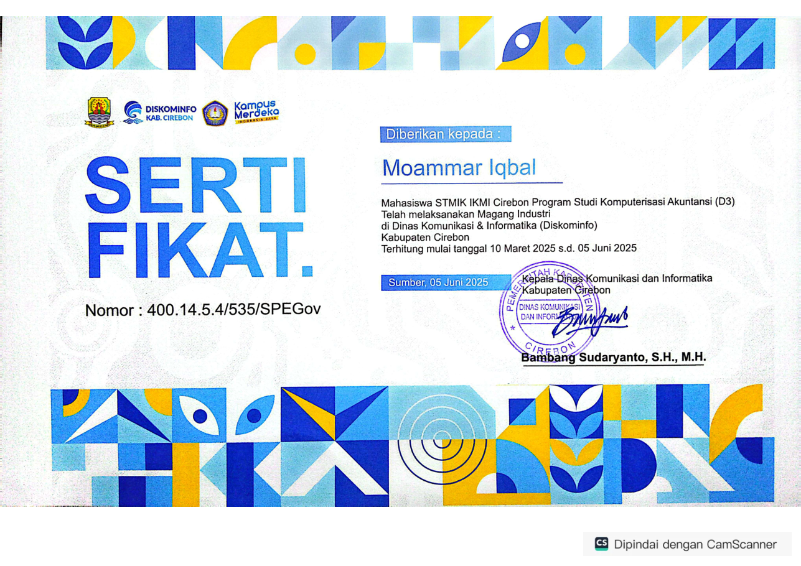

> Catatan: Beberapa detail dibaca dari visual sertifikat.
### Penghargaan Peserta Magang Paling Kreatif
**Penerbit:** Diskominfo Kabupaten Cirebon  
**Bidang:** Internship / Professional Recognition  
**File:** [Lihat Sertifikat](assets/certificates/magang-sertifikat-penghargaan.pdf)

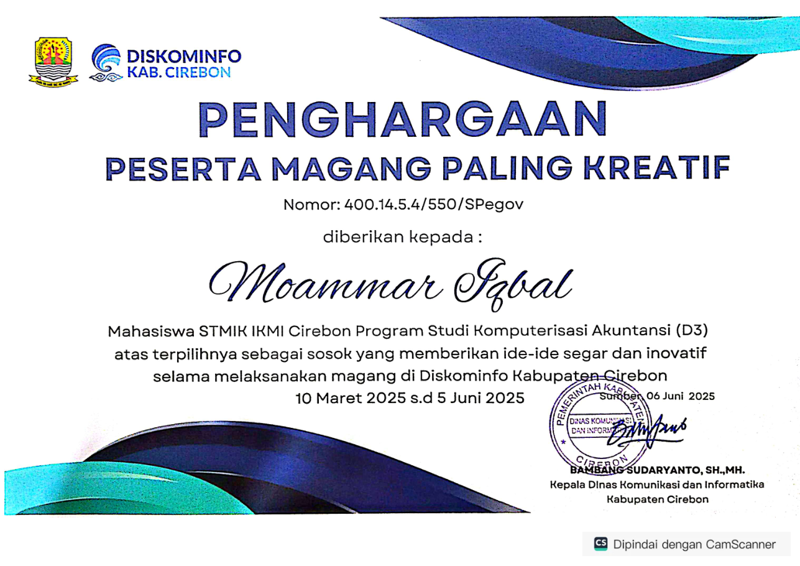

> Catatan: Beberapa detail dibaca dari visual sertifikat.
### CPA: Programming Essentials in C++ - Statement of Achievement
**Penerbit:** Cisco Networking Academy / C++ Institute  
**Bidang:** C++ Programming  
**File:** [Lihat Sertifikat](assets/certificates/programming-skills-c-moammariqbal-certificate.pdf)

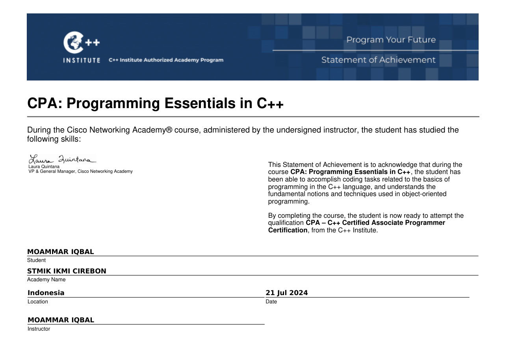
### Partner: CPA - Programming Essentials in C++
**Penerbit:** Cisco Networking Academy  
**Bidang:** C++ Programming  
**File:** [Lihat Sertifikat](assets/certificates/programming-skills-c-salinan-certificate-c.pdf)

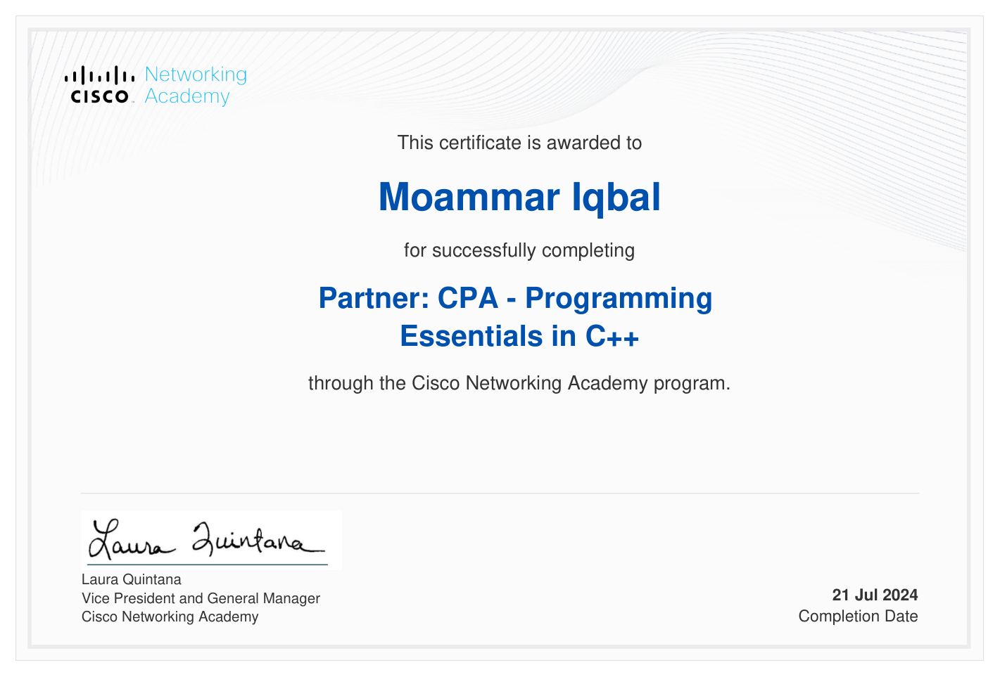
### Database Programming with PL/SQL
**Penerbit:** Oracle Academy  
**Bidang:** Database / PL/SQL  
**File:** [Lihat Sertifikat](assets/certificates/programming-skills-database-programming-pl-sql.pdf)

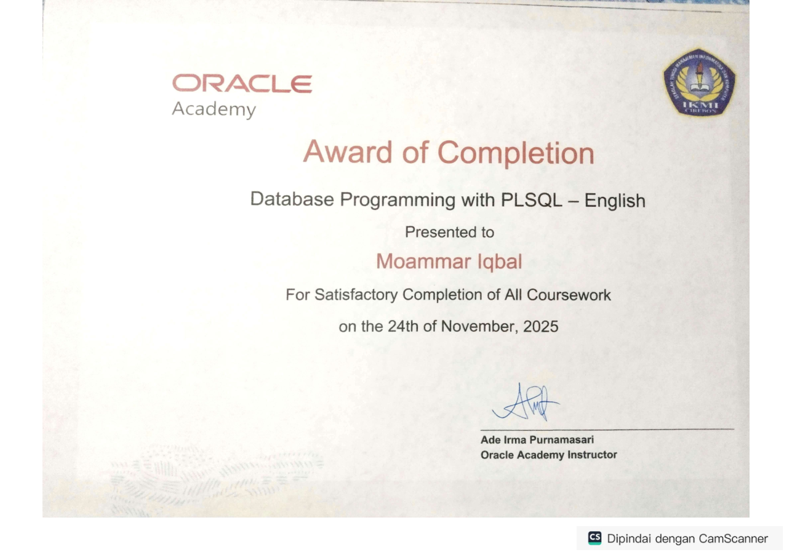

> Catatan: Detail diambil dari visual sertifikat karena teks PDF tidak terbaca penuh.
### Database Programming with SQL
**Penerbit:** Oracle Academy  
**Bidang:** Database / SQL  
**File:** [Lihat Sertifikat](assets/certificates/programming-skills-database-sertifikat-database-design-with-programming-sql.pdf)

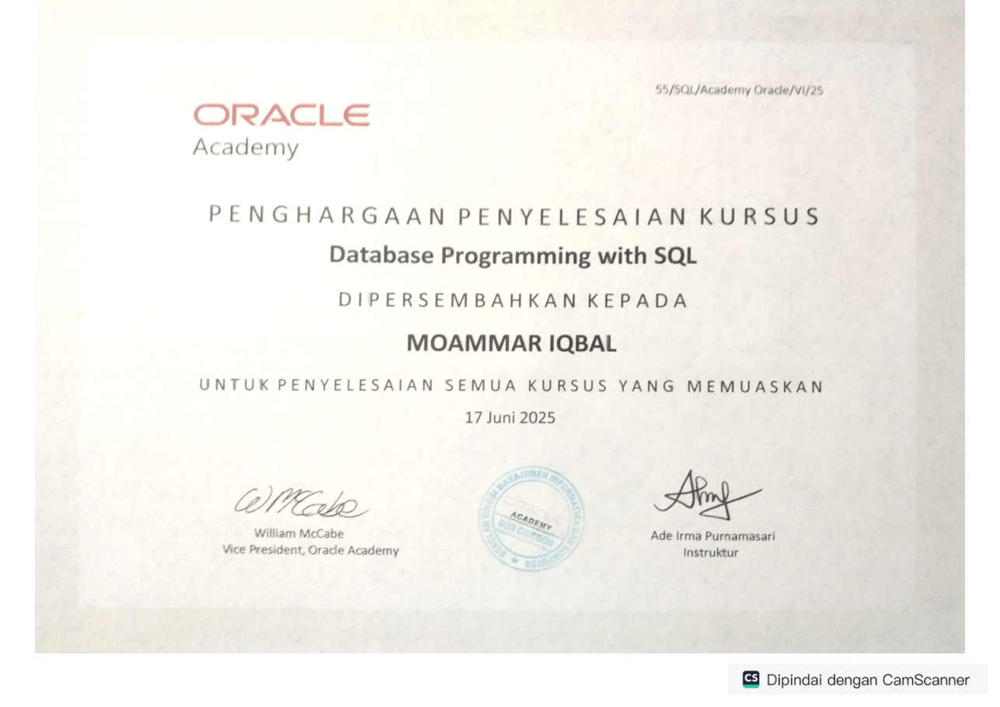

> Catatan: Detail diambil dari visual sertifikat karena teks PDF tidak terbaca penuh.
### NDG Linux Essentials - Statement / Course Completion
**Penerbit:** Cisco Networking Academy / NDG  
**Bidang:** Linux Fundamentals  
**File:** [Lihat Sertifikat](assets/certificates/programming-skills-linux-salinan-moammariqbal-ndg-ka-2023-2024-certificate-1.pdf)

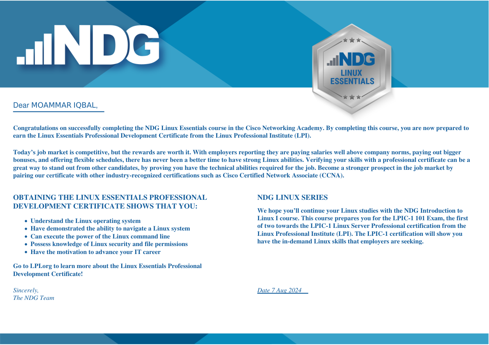
### Partner: NDG Linux Essentials
**Penerbit:** Cisco Networking Academy  
**Bidang:** Linux Fundamentals  
**File:** [Lihat Sertifikat](assets/certificates/programming-skills-linux-salinan-certificate-ndg-linux.pdf)

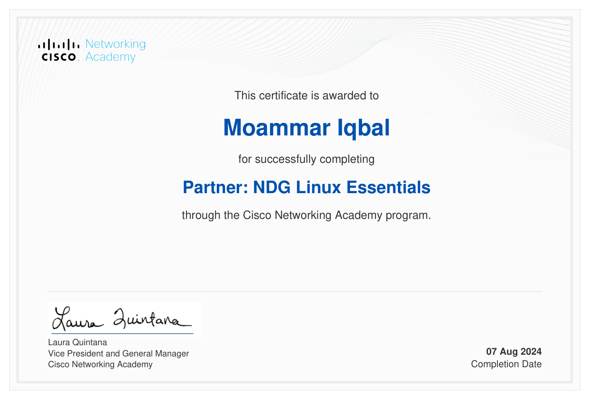
### PCAP: Programming Essentials in Python - Statement of Achievement
**Penerbit:** Cisco Networking Academy / OpenEDG Python Institute  
**Bidang:** Python Programming  
**File:** [Lihat Sertifikat](assets/certificates/programming-skills-python-salinan-bagi-moammariqbal-pcap-ka-2023-certificate.pdf)

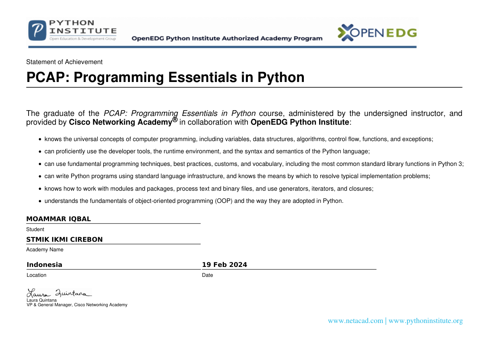
### Partner: PCAP - Programming Essentials in Python
**Penerbit:** Cisco Networking Academy  
**Bidang:** Python Programming  
**File:** [Lihat Sertifikat](assets/certificates/programming-skills-python-salinan-certificate-phyton.pdf)

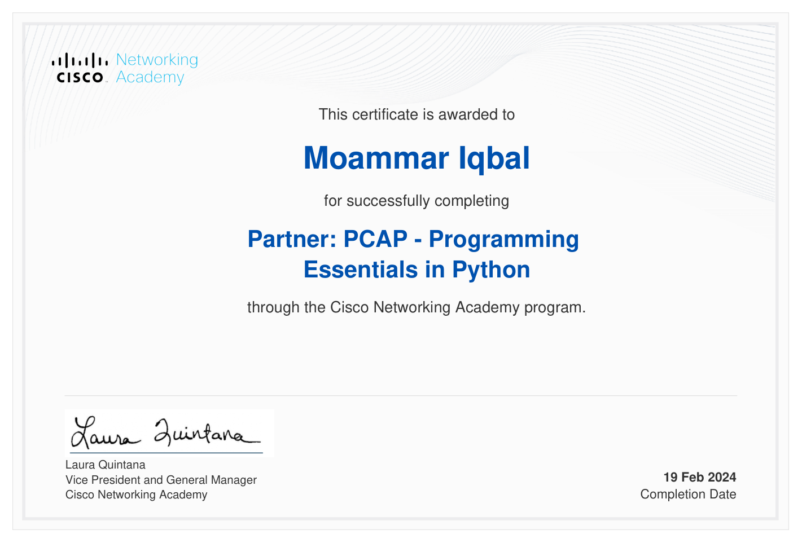
### Sertifikat Pelatihan Junior Web Developer - VSGA Digital Talent Scholarship 2024
**Penerbit:** BPSDMP Bandung / Kementerian Kominfo  
**Bidang:** Web Development  
**File:** [Lihat Sertifikat](assets/certificates/programming-skills-web-programming-certificate-dts-vsga-junior-web-developer.pdf)

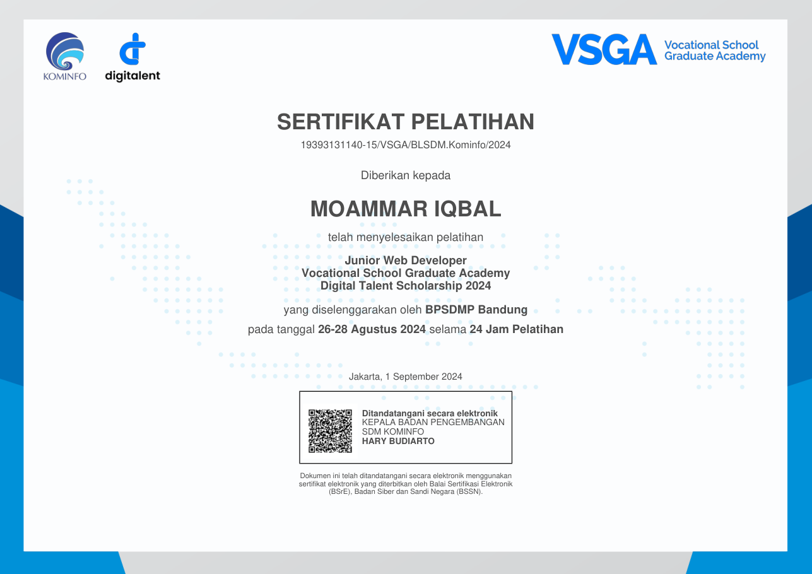
### Sertifikat Kompetensi Junior Web Developer
**Penerbit:** Lembaga Sertifikasi Profesi / BNSP  
**Bidang:** Web Development  
**File:** [Lihat Sertifikat](assets/certificates/programming-skills-web-programming-sertifikat-lsp-junior-web-developer.pdf)

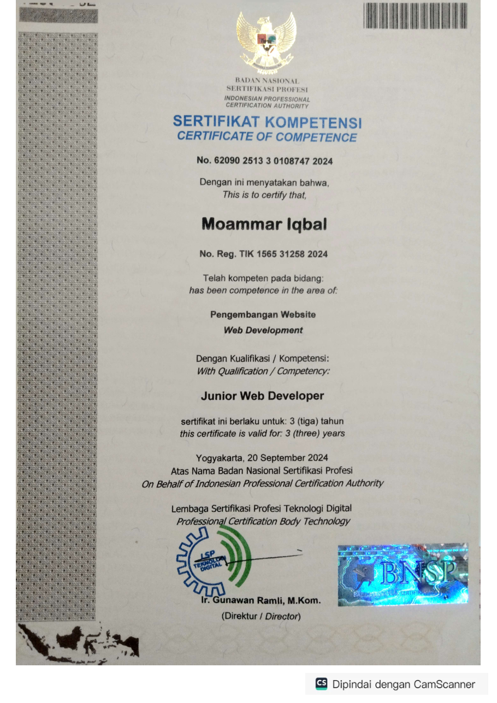

> Catatan: Detail diambil dari visual sertifikat karena teks PDF tidak terbaca penuh.
### Volunteer / Panitia Mini Workshop Website Tanpa Coding
**Penerbit:** Android Developer Community  
**Bidang:** Workshop & Community Participation  
**File:** [Lihat Sertifikat](assets/certificates/workshop-partisipasi-sertifikat-panitia-mini-workshop-moammar-iqbal.pdf)

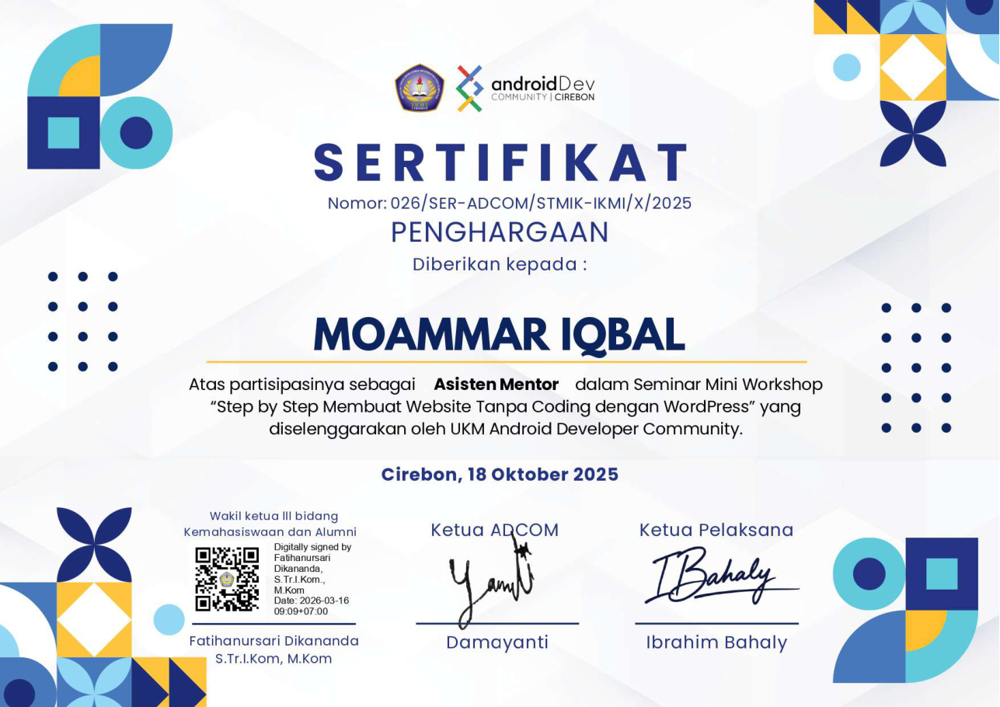

> Catatan: Detail diambil dari visual sertifikat.
### Peserta Workshop Time Series & Forecasting
**Penerbit:** APTIKOM / Pesta Data Nasional  
**Bidang:** Forecasting / Time Series  
**File:** [Lihat Sertifikat](assets/certificates/workshop-partisipasi-sertifikat-forecasting-moammar-iqbal.pdf)

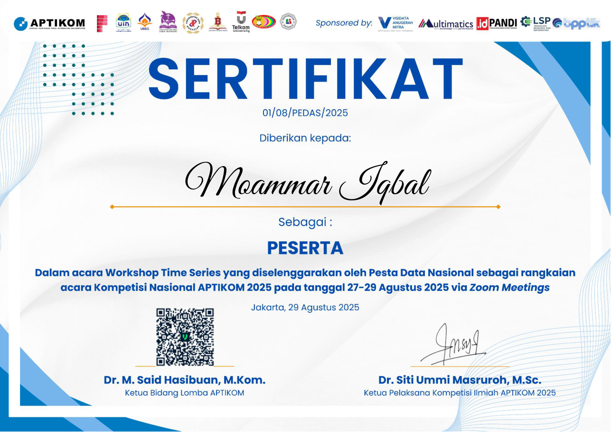
### Peserta Seminar Mini Workshop UI/UX Skills for The Modern Design
**Penerbit:** Android Developer Community  
**Bidang:** UI/UX Design  
**File:** [Lihat Sertifikat](assets/certificates/workshop-partisipasi-sertifikat-ui-ux-moammar-iqbal.pdf)

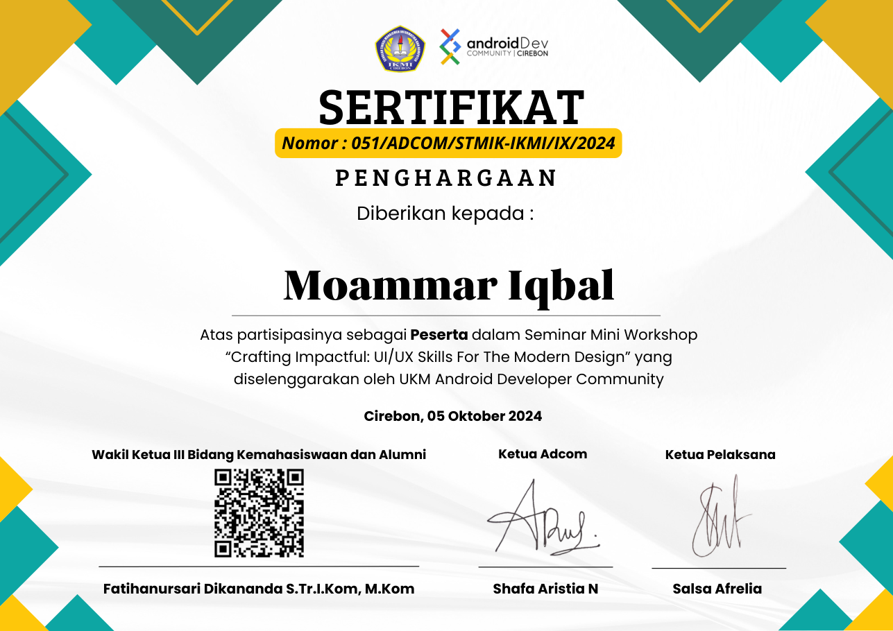

---

## Pendidikan

### STMIK IKMI Cirebon

**Program Studi:** Komputerisasi Akuntansi  
**Periode:** 2023 - 2026  
**Keterangan:** Program studi yang mengintegrasikan teknologi komputer dengan sistem dan pencatatan akuntansi. Mempelajari sistem akuntansi terkomputerisasi, pengolahan laporan keuangan, dan pengembangan sistem berbasis web.

### SMKS Muhammadiyah Cirebon

**Periode:** 2020 - 2023  
**Keterangan:** Menyelesaikan pendidikan menengah kejuruan dengan hasil baik serta aktif dalam kegiatan sekolah dan pengembangan keterampilan teknologi dasar.

---

## Organisasi dan Pelatihan

### Android Developer Community

**Periode:** 2024 - 2026  
**Tipe:** Organisasi Kampus

Aktif dalam organisasi kampus dan pelatihan pengembangan sistem berbasis web. Terbiasa bekerja dalam tim, berkolaborasi lintas divisi, dan mengikuti workshop pengembangan kompetensi.

### Junior Web Developer - Vocational School Graduate Academy Digital Talent Scholarship

**Periode:** 2024  
**Tipe:** Pelatihan Nasional

Peserta program pelatihan nasional bidang teknologi informasi. Pelatihan ini membantu melatih ketelitian, logika sistem, pengelolaan data terstruktur, dan penyelesaian tugas berbasis proyek.

---

## Galeri Project

---

## Kontak

- **Email:** ikbal30042005@gmail.com
- **Phone:** 089633413511
- **LinkedIn:** Moammar Iqbal
- **GitHub:** MoammarIqbal
- **Website:** Tidak tersedia di CV
- **Lokasi:** Cirebon, Jawa Barat
- **CV PDF:** [Lihat CV](assets/other/curriculum-vitae-moammar-iqbal.pdf)

---

## Catatan Portofolio

Portofolio ini disusun berdasarkan dokumen portofolio, CV, aset visual, dan sertifikat yang tersedia. Detail yang tidak terbaca jelas pada beberapa sertifikat PDF diberi catatan agar tidak menambahkan informasi yang tidak dapat diverifikasi.
